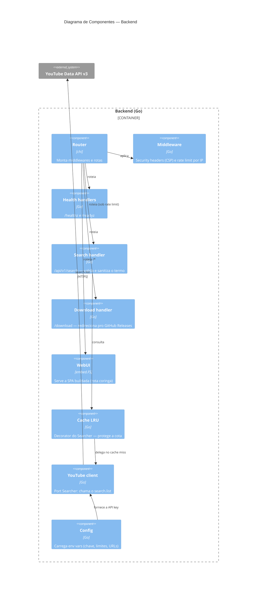

# C4 — Componentes (Backend)

Por dentro do container do backend. A busca passa por um cache LRU (decorator)
antes de chegar ao cliente do YouTube, protegendo a cota. As dependências externas
ficam atrás de interfaces (port `Searcher`).

