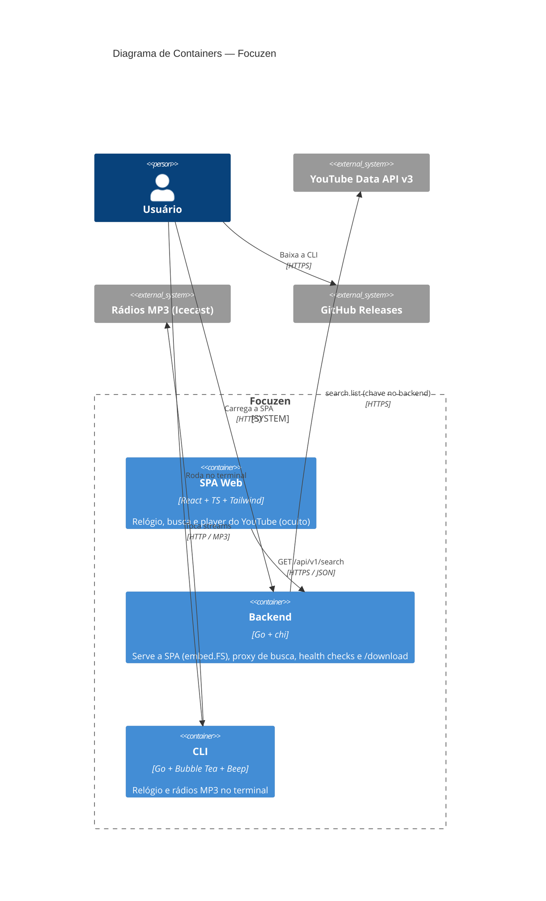

# C4 — Containers

Os blocos executáveis do Focuzen. A SPA é embarcada no binário do backend
(`embed.FS`), então web e API vivem na mesma origem. A CLI é independente.

```mermaid
C4Container
  title Diagrama de Containers — Focuzen

  Person(user, "Usuário")

  System_Boundary(focuzen, "Focuzen") {
    Container(spa, "SPA Web", "React + TS + Tailwind", "Relógio, busca e player do YouTube (oculto)")
    Container(backend, "Backend", "Go + chi", "Serve a SPA (embed.FS), proxy de busca, health checks e /download")
    Container(cli, "CLI", "Go + Bubble Tea + Beep", "Relógio e rádios MP3 no terminal")
  }

  System_Ext(youtube, "YouTube Data API v3")
  System_Ext(radios, "Rádios MP3 (Icecast)")
  System_Ext(releases, "GitHub Releases")

  Rel(user, backend, "Carrega a SPA", "HTTPS")
  Rel(spa, backend, "GET /api/v1/search", "HTTPS / JSON")
  Rel(backend, youtube, "search.list (chave no backend)", "HTTPS")
  Rel(user, cli, "Roda no terminal")
  Rel(cli, radios, "Toca streams", "HTTP / MP3")
  Rel(user, releases, "Baixa a CLI", "HTTPS")
```
