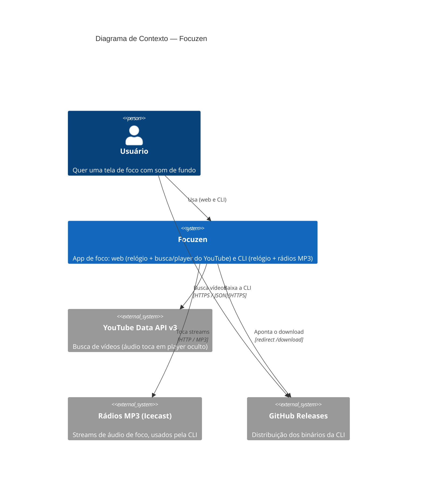

# C4 — Contexto

Visão de mais alto nível: o Focuzen e os sistemas externos com que interage.
O usuário usa a web (relógio + busca/player do YouTube) e/ou a CLI (relógio + rádios).

```mermaid
C4Context
  title Diagrama de Contexto — Focuzen

  Person(user, "Usuário", "Quer uma tela de foco com som de fundo")

  System(focuzen, "Focuzen", "App de foco: web (relógio + busca/player do YouTube) e CLI (relógio + rádios MP3)")

  System_Ext(youtube, "YouTube Data API v3", "Busca de vídeos (áudio toca em player oculto)")
  System_Ext(radios, "Rádios MP3 (Icecast)", "Streams de áudio de foco, usados pela CLI")
  System_Ext(releases, "GitHub Releases", "Distribuição dos binários da CLI")

  Rel(user, focuzen, "Usa (web e CLI)")
  Rel(focuzen, youtube, "Busca vídeos", "HTTPS / JSON")
  Rel(focuzen, radios, "Toca streams", "HTTP / MP3")
  Rel(user, releases, "Baixa a CLI", "HTTPS")
  Rel(focuzen, releases, "Aponta o download", "redirect /download")
```
